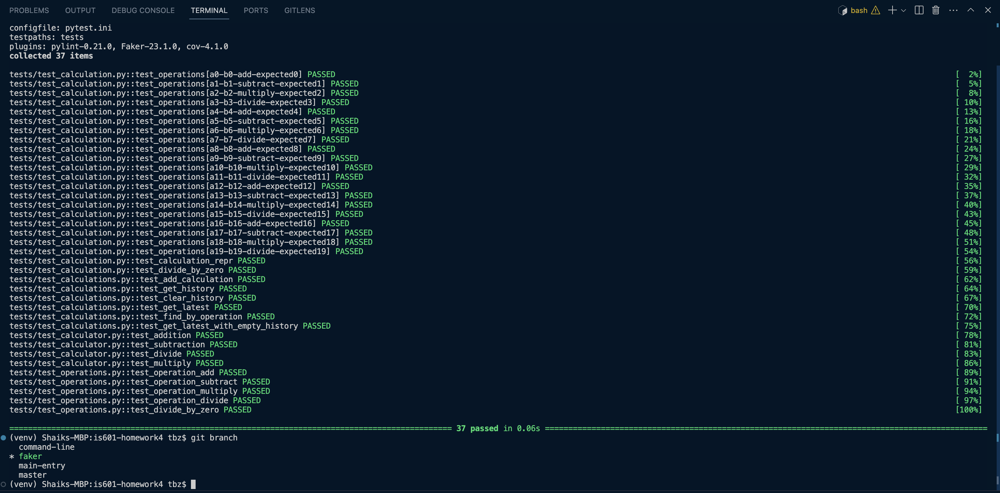

# Homework4
## Faker, Generating test data, and adding your package to command line app.

This assignment introduces three new features to the calculator app.
- Use of Faker library for the generation of fake data.
- Using of command line to generate N number of records dynamically for faker.
- Introduction of main.py which serves as the main entry point of the app and also can be used in terminal with custom user inputs.

In this repository, you can see that there are 3 newly created branches for three features that were merged with their respective Pull Requests:
1. faker - Add faker library to the calculator app and update the requirements.txt and test cases accordingly.

2. command-line - Customize test cases with dynamic number of records for testing by adding new commandline to faker.

3. main-entry - Usage via terminal for the given tests:
- a, b, operation, expected result
- "5", "3", 'add', "The result of 5 add 3 is equal to 8"
- "10", "2", 'subtract', "The result of 10 subtract 2 is equal to 8"
- "4", "5", 'multiply', "The result of 4 multiply 5 is equal to 20"
- "20", "4", 'divide', "The result of 20 divide 4 is equal to 5"
- "1", "0", 'divide', "An error occurred: Cannot divide by zero"
- "9", "3", 'unknown', "Unknown operation: unknown" # Test for unknown operation
- "a", "3", 'add', "Invalid number input: a or 3 is not a valid number." # Testing invalid number input
- "5", "b", 'subtract', "Invalid number input: 5 or b is not a valid number." # Testing another invalid number input

4. master - This is the default branch, where all the other branches were merged. Please find the test cases up and running in master.

### Code merges that occured with pull requests:
- faker branch : https://github.com/tabrezdn1/is601-homework4/pull/1
- command-line branch : https://github.com/tabrezdn1/is601-homework4/pull/2
- main-entry branch : https://github.com/tabrezdn1/is601-homework4/pull/3